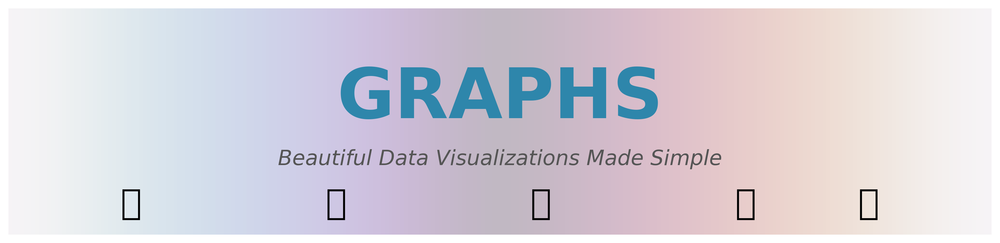
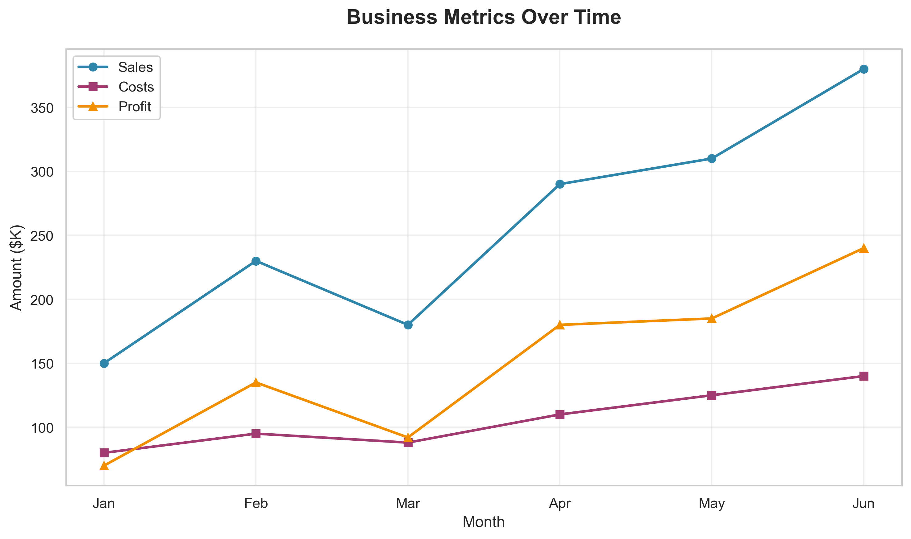
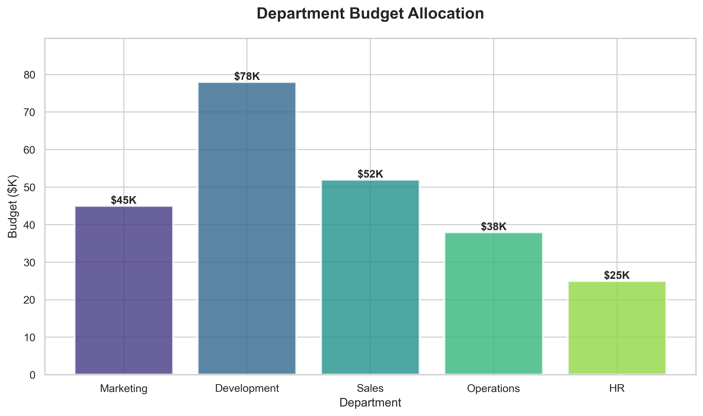
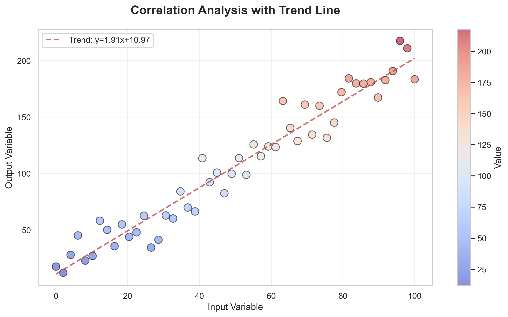
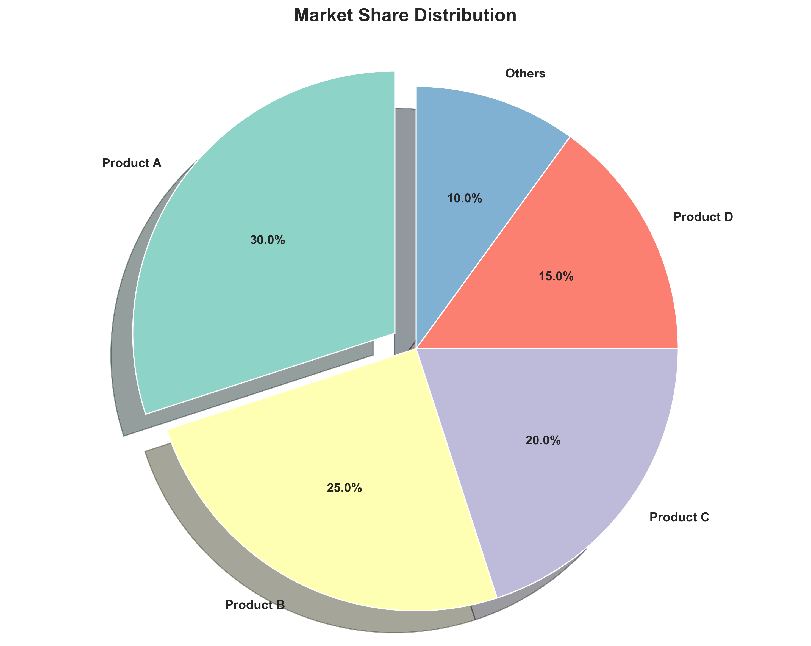
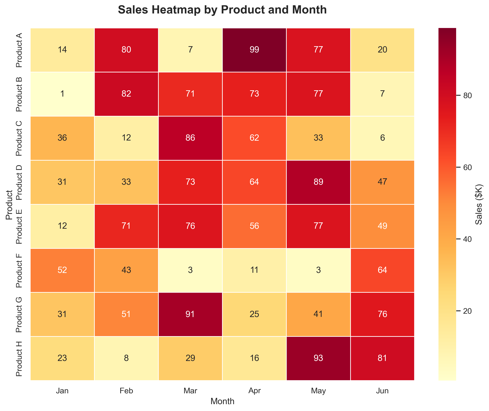
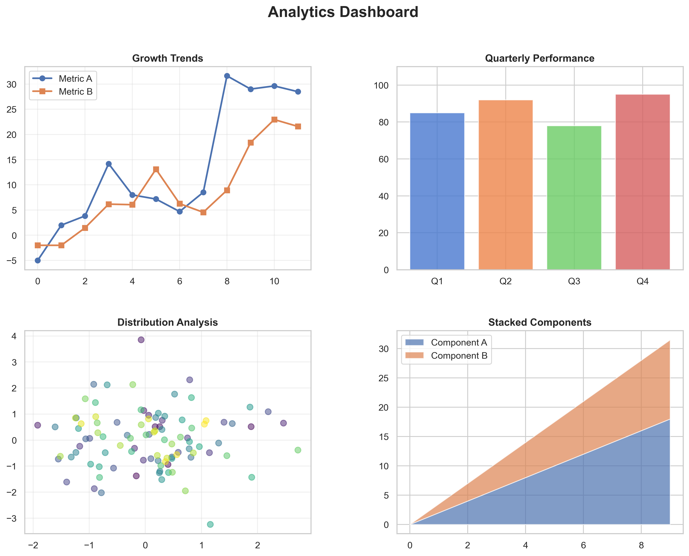
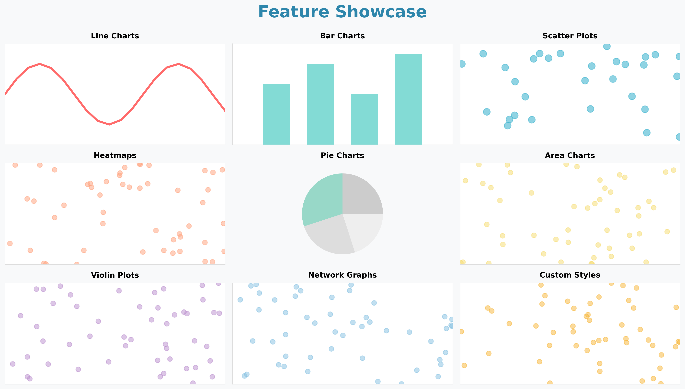

<div align="center">



# Graphs Visualization Repository

[](https://www.python.org/)
[](LICENSE)
[](https://matplotlib.org/)
[](https://seaborn.pydata.org/)
[](https://github.com/migdam/graphs/stargazers)

A comprehensive Python library for creating beautiful data visualizations and graphs. This repository contains ready-to-use scripts for generating various types of charts from CSV data.

[Features](#-features) • [Gallery](#-gallery) • [Installation](#-getting-started) • [Usage](#-usage-examples) • [Contributing](#-contributing)

</div>

## 📸 Gallery

### Sample Visualizations

<table>
  <tr>
    <td></td>
    <td></td>
  </tr>
  <tr>
    <td align="center"><b>Line Chart</b> - Trend analysis over time</td>
    <td align="center"><b>Bar Chart</b> - Categorical comparisons</td>
  </tr>
  <tr>
    <td></td>
    <td></td>
  </tr>
  <tr>
    <td align="center"><b>Scatter Plot</b> - Correlation with trend lines</td>
    <td align="center"><b>Pie Chart</b> - Distribution visualization</td>
  </tr>
  <tr>
    <td></td>
    <td></td>
  </tr>
  <tr>
    <td align="center"><b>Heatmap</b> - Matrix data visualization</td>
    <td align="center"><b>Dashboard</b> - Multi-panel analytics</td>
  </tr>
</table>

### All Chart Types at a Glance



## 🎯 Features

- **8 Visualization Types**: Line charts, bar charts, heatmaps, scatter plots, pie/donut charts, area charts, violin plots, and network graphs
- **Multiple Export Formats**: PNG, SVG, and PDF support
- **Error Handling**: Robust validation and error reporting
- **Flexible Configuration**: Command-line arguments for customization
- **Professional Styling**: Beautiful default themes using Seaborn
- **Statistical Analysis**: Trend lines, correlations, and distributions
- **Network Visualization**: Graph theory visualizations with NetworkX

## 📁 Structure

```
graphs/
├── scripts/           # Python visualization scripts
│   ├── line_chart.py      # Time series and trend visualization
│   ├── bar_chart.py       # Categorical comparison
│   ├── heatmap.py         # Matrix and correlation visualization
│   ├── scatter_plot.py    # Correlation with trend lines
│   ├── pie_chart.py       # Distribution (pie/donut)
│   ├── area_chart.py      # Stacked time series
│   ├── violin_plot.py     # Statistical distributions
│   └── network_graph.py   # Network/graph relationships
├── data/              # Sample datasets
│   ├── sample_data.csv
│   ├── time_series_data.csv
│   ├── categorical_data.csv
│   ├── correlation_data.csv
│   ├── network_data.csv
│   └── statistical_data.csv
├── examples/          # Output directory for generated charts
├── requirements.txt   # Python dependencies
└── README.md         # This file
```

## 🚀 Getting Started

### Prerequisites

- Python 3.8 or higher
- pip (Python package manager)

### Installation

1. **Clone the repository:**
```bash
git clone https://github.com/migdam/graphs.git
cd graphs
```

2. **Create a virtual environment (recommended):**
```bash
# Create virtual environment
python -m venv venv

# Activate on macOS/Linux
source venv/bin/activate

# Activate on Windows
venv\Scripts\activate
```

3. **Install dependencies:**
```bash
pip install -r requirements.txt
```

## 📊 Usage Examples

### Line Chart
Visualize trends over time with multiple series:
```bash
python scripts/line_chart.py --data data/sample_data.csv --output examples/line_chart.png

# Export as SVG
python scripts/line_chart.py --data data/sample_data.csv --format svg
```

### Bar Chart
Compare categorical data:
```bash
python scripts/bar_chart.py --data data/sample_data.csv --output examples/bar_chart.png
```

### Heatmap
Visualize matrix data and correlations:
```bash
python scripts/heatmap.py --data data/sample_data.csv --output examples/heatmap.png
```

### Scatter Plot
Show correlations with optional trend lines:
```bash
# With trend line (default)
python scripts/scatter_plot.py --data data/correlation_data.csv --x x --y y

# With color coding by category
python scripts/scatter_plot.py --data data/correlation_data.csv --x x --y y --color category

# Without trend line
python scripts/scatter_plot.py --data data/correlation_data.csv --no-trend
```

### Pie/Donut Chart
Show distribution of categories:
```bash
# Pie chart
python scripts/pie_chart.py --data data/categorical_data.csv

# Donut chart
python scripts/pie_chart.py --data data/categorical_data.csv --donut
```

### Area Chart
Visualize stacked time series:
```bash
# Stacked area chart
python scripts/area_chart.py --data data/time_series_data.csv

# Overlapping (non-stacked)
python scripts/area_chart.py --data data/time_series_data.csv --no-stack

# Specific columns only
python scripts/area_chart.py --data data/time_series_data.csv --columns sales profit
```

### Violin Plot
Show statistical distributions:
```bash
# Basic violin plot
python scripts/violin_plot.py --data data/statistical_data.csv

# With color grouping
python scripts/violin_plot.py --data data/statistical_data.csv --hue category --split
```

### Network Graph
Visualize relationships and networks:
```bash
# Basic network graph
python scripts/network_graph.py --data data/network_data.csv

# Different layout
python scripts/network_graph.py --data data/network_data.csv --layout circular

# With edge weights
python scripts/network_graph.py --data data/network_data.csv --weight weight
```

## 🛠️ Command-Line Options

All scripts support these common options:

- `--data`: Path to input CSV file
- `--output`: Path to save output image
- `--format`: Output format (`png`, `svg`, `pdf`)

Script-specific options:

**scatter_plot.py:**
- `--x`: X-axis column name
- `--y`: Y-axis column name
- `--color`: Color coding column
- `--no-trend`: Disable trend line

**pie_chart.py:**
- `--category`: Category column name
- `--value`: Value column name
- `--donut`: Create donut chart

**area_chart.py:**
- `--time`: Time/x-axis column name
- `--columns`: Specific columns to plot
- `--no-stack`: Disable stacking

**violin_plot.py:**
- `--x`: Category column
- `--y`: Value column
- `--hue`: Color grouping column
- `--split`: Split violins

**network_graph.py:**
- `--source`: Source node column
- `--target`: Target node column
- `--weight`: Edge weight column
- `--layout`: Layout algorithm (`spring`, `circular`, `random`, `shell`)

## 📝 Data Format Requirements

### Line Chart, Bar Chart, Heatmap
Requires columns: `date`, `category`, `value`
```csv
date,category,value
2024-01-01,A,100
2024-01-01,B,150
```

### Scatter Plot
Requires columns: `x`, `y`, optional `category`
```csv
x,y,category
12,45,A
18,52,A
```

### Pie/Donut Chart
Requires columns: `category`, `value`
```csv
category,value
Marketing,25000
Development,45000
```

### Area Chart
Requires: time column + numeric value columns
```csv
date,sales,costs,profit
2024-01-01,1500,800,700
```

### Violin Plot
Requires columns: `category`, `value`
```csv
category,value
Group A,23
Group A,28
```

### Network Graph
Requires columns: `source`, `target`, optional `weight`
```csv
source,target,weight
A,B,3
B,C,2
```

## 🔧 Troubleshooting

### Import Errors
If you see `ModuleNotFoundError`, ensure all dependencies are installed:
```bash
pip install -r requirements.txt
```

### Data File Not Found
Use absolute paths or ensure you're in the correct directory:
```bash
cd graphs
python scripts/line_chart.py --data "$(pwd)/data/sample_data.csv"
```

### Missing Columns Error
Check that your CSV has the required columns for the chart type. The error message will show available columns.

### Display Issues
If charts don't display on headless systems, remove `plt.show()` from scripts or use:
```bash
export MPLBACKEND=Agg
```

## 🤝 Contributing

Contributions are welcome! Here's how you can help:

1. **Fork the repository**
2. **Create a feature branch** (`git checkout -b feature/AmazingFeature`)
3. **Commit your changes** (`git commit -m 'Add some AmazingFeature'`)
4. **Push to the branch** (`git push origin feature/AmazingFeature`)
5. **Open a Pull Request**

### Development Guidelines

- Follow PEP 8 style guidelines
- Add docstrings to all functions
- Include error handling and validation
- Test with various data formats
- Update documentation for new features

## 📦 Dependencies

- **matplotlib**: Core plotting library
- **numpy**: Numerical computing
- **pandas**: Data manipulation
- **seaborn**: Statistical visualization
- **plotly**: Interactive plots
- **networkx**: Network graph analysis
- **scipy**: Scientific computing
- **openpyxl**: Excel file support
- **colorama**: Terminal colors
- **argcomplete**: Bash completion

## 📄 License

This project is open source and available under the MIT License.

## 👤 Author

**migdam**
- GitHub: [@migdam](https://github.com/migdam)

## 🙏 Acknowledgments

- Built with [Matplotlib](https://matplotlib.org/)
- Styled with [Seaborn](https://seaborn.pydata.org/)
- Network visualization powered by [NetworkX](https://networkx.org/)

## 📈 Roadmap

- [ ] Interactive Plotly charts
- [ ] Real-time data streaming
- [ ] Dashboard generation
- [ ] Custom color schemes
- [ ] 3D visualizations
- [ ] Animation support
- [ ] Web API interface

## 💬 Support

If you have questions or issues:

1. Check the [Troubleshooting](#-troubleshooting) section
2. Search existing GitHub issues
3. Create a new issue with:
   - Python version
   - Error message
   - Data sample (if applicable)
   - Steps to reproduce

---

⭐ **If you find this project useful, please consider giving it a star!**
